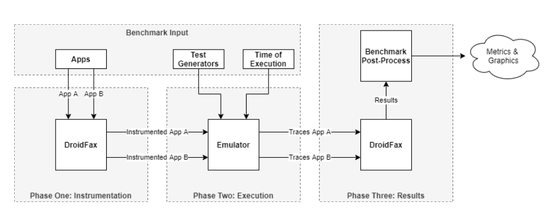

# Benchmark

Simplifying the comparison of existing tools for mining android sandboxes.

## Summary

- [Description](#description)
- [Dependencies](#dependencies)
- [How to run](#how-to-run)
- [How to add your tool](#how-to-add-your-tool)

## Description

Due to the popularization of Android and the full range of applications targeting
this platform, many security issues have emerged, attracting researchers and
practitioners' attention. As such, many techniques for addressing security
Android issues have emerged, including approaches for mining sandboxes using
dynamic analysis tools (i.e., automated testing tools).

Undoubtedly, the resulting sandboxes' efficiency depends on the test case generation
tools used in the mining procedures; and previous research studies have compared Android
test case generation tools for this specific goal.

However, it's difficult to increment the research in this field because reproducing
these previous empirical studies is a challenging and time-consuming task. This
difficulty occurs because it's necessary to integrate test generation tools that
often require different and conflicting versions of the Android platform, programming
languages (e.g., Python 2 and Python 3), and software libraries.

To mitigate this issue, we present our droidxp/benchmark, a software
infrastructure that allows researchers (and tools developers) to integrate and
compare test case generation tools for mining sandboxes.

We evaluated droidxp/benchmark through a reproduction study of previous research work,
though considering additional test case generation tools. Our experiment suggests that
droidxp/benchmark simplifies the comparison of existing tools for mining sandboxes.

### Architecture



## Dependencies

This project depends on:
- Java 7
- Android SDK 23+
- Python 2 or 3
- Pixel 2 android emulator

It's assumed that some commands are in your PATH environment variable: `adb`, `java`, `jarsigner`, `emulator` and `aapt`.

Installation scripts can be found in [droidxp/benchmark-vm](https://github.com/droidxp/benchmark-vm)

## How to run

To run the benchmark, execute the following command:

    python main.py
    
## How to run with arguments

The benchmark controll arguments follows:

    usage: python main.py [-h] [--list-tools] [-tools TOOLS [TOOLS ...]] [-t T [T ...]]
           [-r R] [--list-outputs] [--output OUTPUT] [--debug] [--version]

    optional arguments:
    -h, --help            show this help message and exit
    --list-tools          list available tools
    -tools TOOLS [TOOLS ...]
                          List of test tools used in the experiment
    -t T [T ...]          (-t -time) Threshold of the execution time in the experiment (in seconds)
    -r R                  (-r, -repetitions) Number of repetitions used in the experiment
    --list-outputs        List available output formats
    --output OUTPUT       OUTPUT FORMAT that will be used to show results (default: basic)
    --debug               Run in DEBUG mode (default: false)
    --version             Print the benchmark version   

Here is a sample on how to use the benchmark arguments:

    python main.py -tools monkey droidbot -t 60 -r 3
    
## How to add your tool

1. Create a new package with your tool name
```bash
   mkdir tools/bananadroid
   touch tools/bananadroid/\_\_init\_\_.py
   touch tools/bananadroid/tool.py
```
2. Create ToolSpec class, as AbstractTool child, and `execute_tool_specific_logic` function
```python
from ..tool_spec import AbstractTool

class ToolSpec(AbstractTool):
   '''
   AbstractTool.__init__(self, name, description, process_pattern)
   Args:
      name(str): The name of the tool 
      description(str): The tool's description (such as test case genration, and so on) 
      process_pattern(str): A string with the pattern of the processes to be killed after execution
   '''
   def __init__(self):
      super(ToolSpec, self).__init__('bananadroid', 'Bananadroid tool description', 'org.bananadroid')
   
   '''
   This is our hook method, an extention point that every tool developer 
   must provide an implementation. 
   '''
   def execute_tool_specific_logic(self, file_name, timeout):
      # Bananadroid tool specific initialization method
      pass
```
3. All set, you can test if the benchmark is able to recognize your tool with command
```shell
   >>> python main.py --list-tools
   INFO:root: [Listing available tools] 

    [bananadroid] Bananadroid tool description

   [...]
```

## Tool Specific Dependencies

### Droidbot

To run the benchmark with the droidbot tool, the following dependencies must be satisfied.

   * `Python` (both 2 and 3 are supported)
   * `Java`
   * `Android SDK`
   * Android SDK 18+
   * Add `platform_tools` directory in Android SDK to `PATH`
   * (Optional) `OpenCV-Python` if you want to run DroidBot in cv mode.

Clone the droidbot fork at `https://github.com/droidxp/droidbot-stable.git` and install it with pip:
```shell
git clone https://github.com/honeynet/droidbot.git
cd droidbot/
pip install -e .
```

If successfully installed, you should be able to execute `droidbot -h`.

More info at the README.md from the fork `https://github.com/droidxp/droidbot-stable`.

### Droidmate

To run the benchmark with the droidmate tool, the following dependencies must be satisfied.

   * `Java Development Kit (JDK) 8`
   * `Android SDK`
   * `gnuplot` 5.0+
      * On Mac OS X, must install with `pdf` terminal: `brew install gnuplot --with-cairo`
   * SDK Manager packages:
      * Tools / Android SDK Platform-tools 27.0.3
      * Tools / Android SDK Build-tools
      * Android 6.0 (API 23) / SDK Platform
      * Android 7.1 (API 25) / SDK Platform
      * Extras / Android Support Repository
      * Extras / Google Play services
      * Extras / Google USB Driver (if your OS requires it)
      * Extras / Intel x86 Emulator Accelerator (HAXM Installer) (if you want to use emulator on Windows)
   * Environment Variables
      * `JAVA_HOME`
      * `ANDROID_HOME`
      * `gnuplot` in `PATH`

More info in the wiki `https://github.com/uds-se/droidmate/wiki/Building#environment`.

### Sapienz

Clone the Stoat fork at `https://github.com/droidxp/sapienz.git`. To run the benchmark with the Sapienz tool, the following dependencies must be satisfied.

   * Linux: `sudo apt-get install libfreetype6-dev libxml2-dev libxslt1-dev python-dev`
      * Or Mac OS: `brew install coreutils for gtimeout`
   * Install project Sapienz dependencies by running `sudo pip install -r requirements.txt` at Sapienz root folder.
   * Android SDK 19+

 It is also necessary to add the project folder in `SAPIENZ_HOME` environment variable. Something like:

```sh
export SAPIENZ_HOME=~/workspace-droidxp/sapienz/
```

> **Note:** The environment variable SAPIENZ_HOME needs to end with a '/' character.

### STOAT

To run the benchmark with the stoat tool, the following dependencies must be satisfied.

   * Ruby 2.1
   * Nokogiri (try gem install nokogiri)
   * Python uiautomator library (try pip install uiautomator)
   * Android SDK 18+

Clone the Stoat fork at `https://github.com/rbonifacio/Stoat.git`. It is also necessary to add the `bin` directory of the Stoat project to the PATH environment variable. Something like.

```sh
export STOAT_HOME=~/Documents/workspace-droidxp/Stoat/Stoat
export PATH=$PATH:$STOAT_HOME/bin
```
